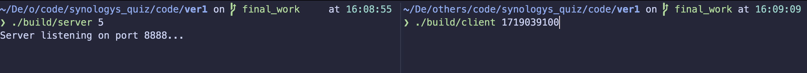
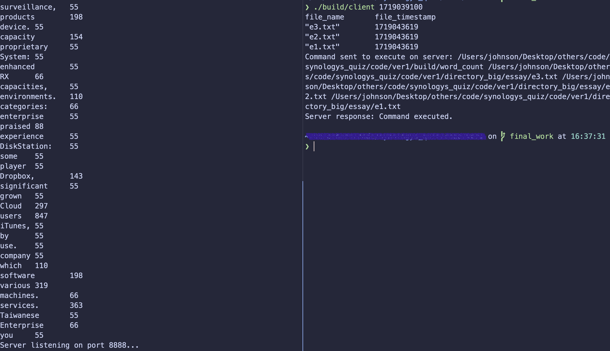

# Usage

# Compile
```
cd build
cmake ..
make -j
```

# Execute

```
// under PROJECT_SOURCE_DIRECTORY, tty1
// 6 sub-processes
./build/server 6
```

```
// under PROJECT_SOURCE_DIRECTORY, tty2
// Target files whose last_write_time is later than 1718897720
./build/client 1718897720
```

And the word count would be output on the server side.


